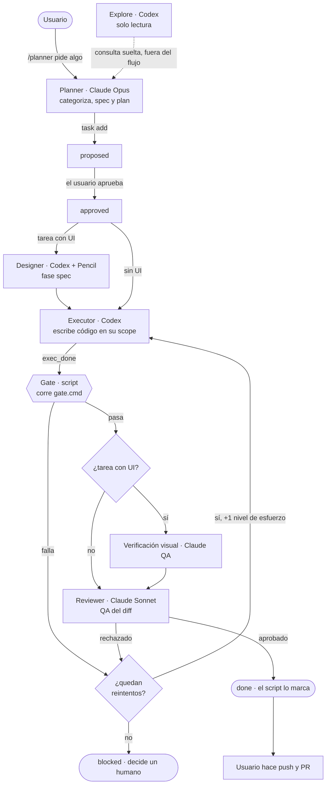

# software-engineer (harness-core)

Orquestador determinista (sin LLM) para trabajar con agentes de código: guarda el estado de cada tarea, la clasifica (categoría + tier de riesgo), decide qué modelo y esfuerzo usa cada rol, corre el gate de verificación y mide el gasto.

**Reparto de roles**

| Rol | Corre en | Qué hace |
|---|---|---|
| `planner` | Claude (Opus) | Habla contigo, escribe spec y plan, orquesta al resto |
| `executor` | Codex (vía Herdr) | Escribe el código dentro del scope aprobado |
| `reviewer` | Claude (Sonnet) | QA y revisión visual |
| `designer` | Codex + Pencil (o Claude) | Diseño de UI |
| `explore` | Codex | Preguntas de solo lectura sobre el código |

El gate lo corre el script; ningún agente marca una tarea como `done`.

## Cómo se comportan los agentes

Ciclo de vida de una tarea (`harness next <id>` devuelve el siguiente paso según el estado):



Quién decide qué:
- **El script** (`harness`) manda: calcula el siguiente paso, el modelo y el esfuerzo, corre el gate y marca `done`. Los agentes no se auto-aprueban.
- **El planner** solo planifica y lanza lo que `harness next` indica; no escribe código ni reemplaza a un agente caído.
- **Si Codex falla**, el script reintenta una vez con más esfuerzo y luego pasa la tarea a `blocked`. Cambiar el executor a Claude es una decisión humana.

## Requisitos
- node ≥ 20 y pnpm (`brew install pnpm`)
- Claude Code
- Para `exec`: [Herdr](https://herdr.dev) y Codex CLI. Para el designer: la app Pencil abierta.

## Instalación (una vez por máquina)
```bash
cd software-engineer
pnpm run setup                  # pnpm install + enlaces + comprobación
pnpm run setup -- --uninstall   # quita solo los dos enlaces
```
Crea `~/.claude/skills/harness` (comando `/harness` en Claude Code) y `~/.local/bin/harness` (comando `harness`). Es idempotente y no pisa enlaces ajenos. Asegúrate de que `~/.local/bin` esté en tu `PATH`.

## Guía de uso

### 1. Preparar un proyecto
Desde la raíz del proyecto:
```bash
harness init                 # dry-run: detecta stack, gate, rutas sensibles
harness init --apply         # escribe lo propuesto
```
O dentro de Claude Code: `/harness init` (te muestra el plan y pregunta antes de escribir).

Genera `.harness/` (`profile.json`, `backlog.json`, `recommendations.md`), `AGENTS.md` y `.claude/agents/*.md`. No pisa nada existente sin `--force`. Revisa `.harness/profile.json`, sobre todo `gate.cmd` (tu comando de verificación) y `tiers.t2` (rutas críticas: migraciones, auth, billing, infra).

### 2. Trabajar una tarea
En Claude Code, en el proyecto:
```
/planner agrega login con Google
```
El planner categoriza, escribe el plan, registra la tarea y te pide aprobación. Luego lanza executor → reviewer → gate. Tú solo apruebas y haces el push al final (el harness nunca hace push ni merge).

### 3. Hacerlo a mano (CLI)
```bash
harness task add T1 --title "Login con Google" --category feature --paths 'src/auth/**'
harness task approve T1
harness next T1                       # siguiente paso: rol, modelo, esfuerzo
harness exec T1 --instruction "..."   # executor en Codex (pane lateral de Herdr)
harness exec T1 --role explore --instruction "¿dónde se valida el token?"
harness gate T1                       # corre el gate y mueve el estado
```
Categorías: `feature fix hotfix refactor perf docs test infrastructure chore release` (`harness categories`). El tier es T0/T1/T2 y gana el más alto entre la categoría y las rutas tocadas (`harness classify <cat> --paths a,b`).

### 4. Configuración y métricas
```bash
harness config get models.designer.use
harness config set models.designer.use claude   # designer en Claude en vez de Codex
harness agents sync                             # regenera el bloque de proyecto de cada agente tras editar el perfil
harness metrics collect                         # métricas en .harness/metrics/*.toon
harness metrics report [T1]                     # informe legible: gasto por rol, intentos, cuota
harness doctor                                  # comprueba el entorno
```
Todo comando acepta `--root DIR` para apuntar a otro proyecto.

## Estructura
```
bin/harness.mjs      CLI
src/classify.mjs     categoría + tier            src/tasks.mjs    máquina de estados
src/router.mjs       modelo/esfuerzo por rol     src/gate.mjs     gate + scope manifest
src/herdr.mjs        Codex por Herdr             src/metrics.mjs  métricas TOON
src/init.mjs         detección del proyecto      src/defaults.mjs perfil y precios por defecto
agents/*.md          prompts de cada rol         skill/SKILL.md   comando /harness
test/                node --test
```

## Desarrollo
```bash
pnpm test
```

## Notas
- Los prompts están en inglés por eficiencia de tokens; los agentes responden en tu idioma.
- Los costos en `src/defaults.mjs` (`PRICES`): la escritura de caché y la lectura de Haiku son supuestos.
- Si Codex no está disponible, el executor no cae a Claude: el planner se detiene y avisa.
